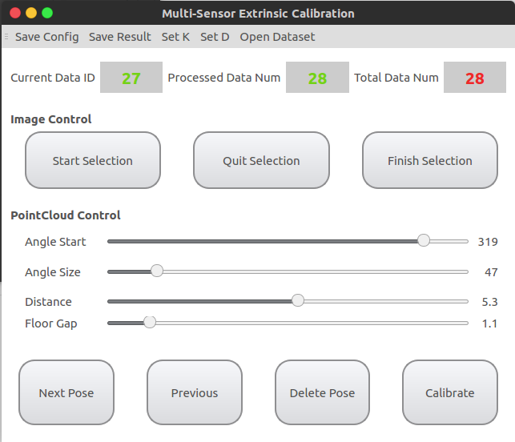
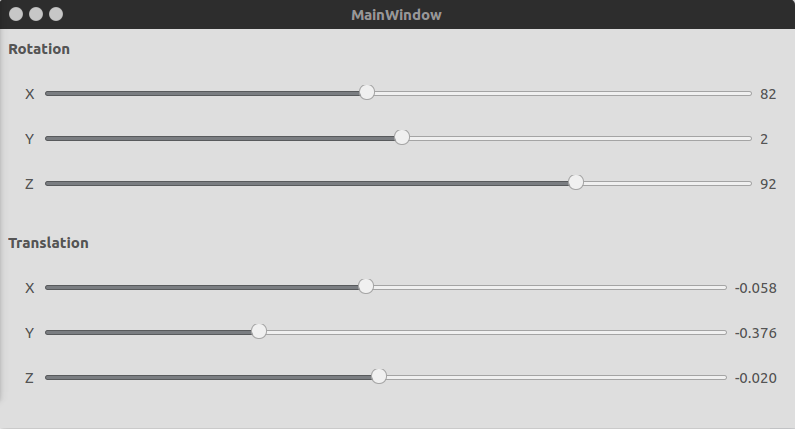
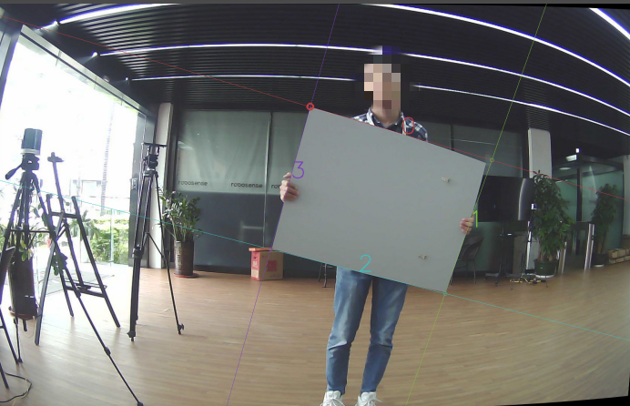
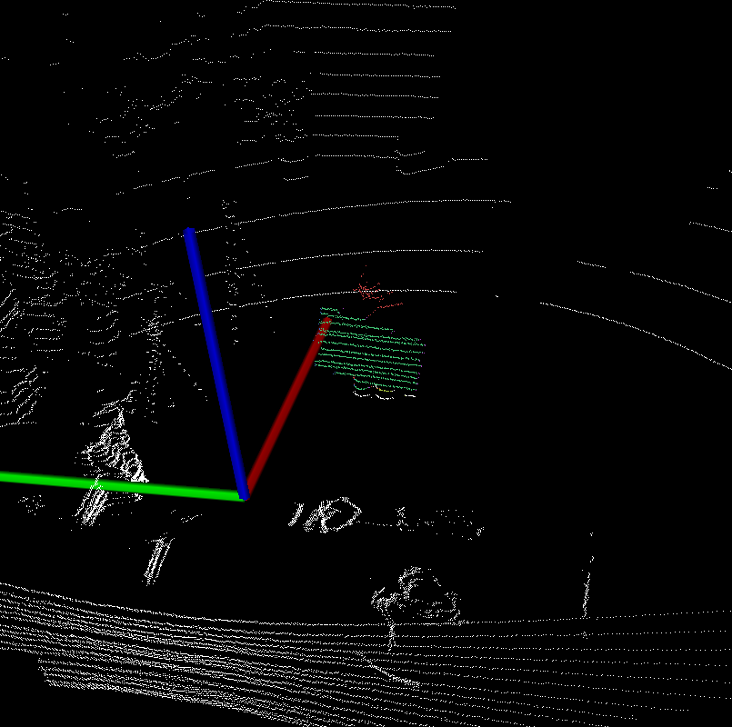

# PlyCal
> LIAO Qinghai  2019.2.25

Currently, this program can only perform the calibration using the quadrilateral plate, and has not yet achieved the calibration using any polygon.

## Preparation  
As shown in the example folder, using this software requires a config.json file and files corresponding to images and point clouds.

config.json: refer to example/config.json, normally you only need to modify the K and D of the camera. There's no requirement for this file path

dataset: dataset refers to `image_orig` and `pointcloud` under example. Please keep the names of these two folders and put them in the same directory. There needs to be N (N>=4) undistorted images in `image_orig`. There are N corresponding .pcd point cloud files in `pointcloud`, and the two should have been synchronized in time. 

## Instructions
1. Open the config file. After launching ./PlyCal-qt in the terminal, you will directly enter the selection of the config.json file. 
2. Open dataset。The main interface is as shown in the figure below. Click on `Open Dataset` to select the folder containing `image_orig` and `pointcloud`. The interface will display the total number of data frames. 
   
3. Manually adjust the initial values. After opening the dataset, the main interface will be hidden, and there will be interface for adjusting the initial value, a window for displaying the point cloud, and a window for displaying the image. (the point cloud will be projected to the image, and the image color will also be projected to the point cloud). In the interface of the figure below, manually adjust rotation, translation and observe the point cloud projection in the image interface at the same time. Simply close the interface if you are done. 
   
4. Manually select the polygon. After returning to the main interface, currently it is still not possible to automatically detect quadrilaterals in both the point cloud and the image for the first time. For the image, you can first click `Start Selection`, then click the four corners of the target quadrilateral in the picture window, and click `Finish Selection` after completion. For the point cloud, use the four slider bars under `Pointcloud Control` to cut the point cloud and constrain the range. The normal results are as follows. A demo detection is shown in the figure below.

5. Detection. After the manual adjustment of the first frame is over, you can use `Next Pose` to process the next frame frame by frame, or use `Quick` to process automatically. If the data detection result is bad, you can go back to step 4 for manual adjustment or `Delete ` the frame
6. Calibrate. Click `Calibrate` to call the calibration optimization. The result will be printed on the terminal, and you can also click `Save Result`. The config file can also be saved (it will overwrite the previous config). 